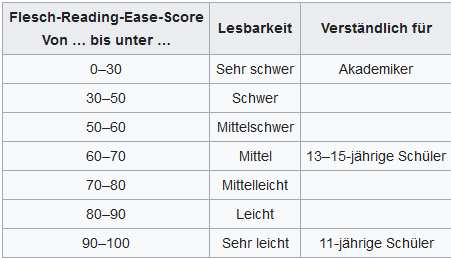

# Reading-indices

Comparison of Reading ease indices (Lesbarkeitsindices) for German novels and news articles using the R packages quanteda and tidytext and ggplot2.

- [Reading-indices for German texts](docs/Lesbarkeitsindex.md)
- Reading-indices for German texts: [html](docs/Lesbarkeitsindex.html)

```{r}

```

